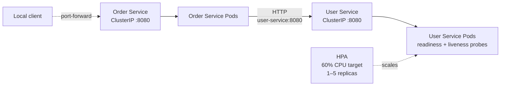

# ☕ Java × Kubernetes Lab

> A hands-on Kubernetes learning project built with Spring Boot,
> Docker and Kind.

## 🎯 Why this project?

A failure-driven Kubernetes laboratory for studying resilience, autoscaling, deployment safety and observability of Java workloads.

The goal is to document the journey from a simple Spring Boot application
to a more complete Kubernetes-based deployment.

## Prerequisites

The lab is currently developed and validated from Windows with PowerShell.
Linux and macOS scripts will be added after the Windows setup is reproducible.

| Tool | Requirement | Used for |
| --- | --- | --- |
| Java | JDK 21 or newer | Compiling the Spring Boot services targeting Java 21 |
| Maven | 3.8 or newer | Building and testing both services |
| Docker | Docker Engine or Docker Desktop, using Linux containers | Building images and running Kind |
| Docker Compose | Compose v2 (`docker compose`) | Running the services without Kubernetes |
| Kind | A recent version | Creating the local Kubernetes cluster |
| kubectl | A version compatible with the Kind cluster | Deploying and observing Kubernetes resources |
| PowerShell | 7 recommended | Running the initial setup and experiment scripts |

Docker Desktop users must enable hardware virtualization and start Docker
before creating the cluster. Allocate enough resources for three Kind nodes;
4 CPUs and 6 GB of memory available to Docker are a practical starting point.

Verify the workstation before continuing:

```powershell
java -version
mvn -version
docker version
docker compose version
kind version
kubectl version --client
```

Also verify that the Docker daemon is reachable:

```powershell
docker info
```

The repository now provides a Bash setup workflow. Its reuse path has been
validated against the local Kind cluster; the complete path from an absent
cluster will be validated after the matching teardown script is available.

### Run the application tests

Each service has focused HTTP controller tests. Run them independently from the
repository root:

```powershell
mvn -f services/user-service/pom.xml test
mvn -f services/order-service/pom.xml test
```

### Build the applications

Build and test the executable JARs locally:

```powershell
mvn -f services/user-service/pom.xml clean package
mvn -f services/order-service/pom.xml clean package
```

The Dockerfiles are multi-stage builds. They compile and test their service in
a Maven builder image, then copy only the executable JAR into a Java runtime
image. A pre-existing local `target/` directory is therefore not required.

Build both container images from the repository root:

```powershell
docker compose build
```

Verify the expected local image tags:

```powershell
docker image inspect k8s-java-lab/user-service:1.0
docker image inspect k8s-java-lab/order-service:1.0
```

### Set up the Kubernetes lab

The Bash setup script performs preflight checks, builds both images, creates or
reuses the `k8s-java-lab` Kind cluster, loads the images, applies the Sprint 1
manifests and waits for both Deployments:

```bash
bash scripts/setup.sh
```

The script refuses an unexpected Kubernetes context and passes the approved
context explicitly to mutating `kubectl` commands. See the
[script reference](scripts/README.md) for its workflow, safety properties,
expected output and troubleshooting commands.

The branch that creates a completely absent cluster will be validated after
the matching destroy script is implemented. The currently validated path
reuses the existing local cluster.

## Architecture overview



- Both services are isolated in the `k8s-java-lab` namespace.
- Kubernetes recommended labels connect Services to their Pods.
- The `order-service` ClusterIP provides a stable endpoint for the application entry point.
- `order-service` calls User Service through Kubernetes internal DNS.
- The `user-service` ClusterIP routes traffic only to ready Pods.
- The Deployment provides self-healing and rolling updates.
- The HPA scales User Service between 1 and 5 replicas based on CPU usage.

See the [detailed architecture documentation](docs/architecture/README.md).

## Documentation

- [Architecture](docs/architecture/README.md)
- [Sprint 1 learning journal](docs/sprints/sprint-1.md): incremental build, commands and observations
- [Lab scripts](scripts/README.md): setup workflow, safety and troubleshooting
- [Demo 1](docs/demo-1/README.md): notes and demonstrated Kubernetes features
- [Watch Demo 1](docs/demo-1/From%20Java%20to%20Kubernetes%20Demo%201.mp4)

## Concepts learned

| Concept | What I learned |
| --- | --- |
| Pod | Smallest deployable unit |
| Deployment | Desired state and replica management |
| Service | Stable networking for Pods |
| DNS | Service-to-service discovery |
| Namespace | Isolates and scopes the lab resources |
| Labels and selectors | Connect and query related Kubernetes objects |
| EndpointSlice | Shows the Pod endpoints selected by a Service |
| Readiness Probe | Controls whether a Pod receives traffic |
| Liveness Probe | Determines whether a container should be restarted |
| Startup Probe | Gives slow-starting applications time to initialize |
| Resources | CPU / memory requests and limits |
| Metrics Server | Provides resource metrics |
| HPA | Automatically scales replicas based on CPU |
| Self-healing | Kubernetes replaces failed Pods |
