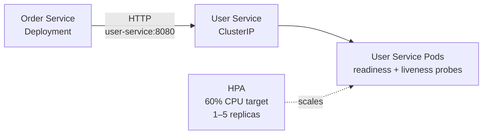

# ☕ Java × Kubernetes Lab

> A hands-on Kubernetes learning project built with Spring Boot,
> Docker and Kind.

## 🎯 Why this project?

I'm learning Kubernetes through hands-on experimentation.

Instead of only studying Kubernetes concepts, I'm building a small
Java microservices platform and intentionally breaking it to understand
how Kubernetes reacts.

The goal is to document the journey from a simple Spring Boot application
to a more complete Kubernetes-based deployment.

## Architecture overview

- `order-service` calls User Service through Kubernetes internal DNS.
- The `user-service` ClusterIP routes traffic only to ready Pods.
- The Deployment provides self-healing and rolling updates.
- The HPA scales User Service between 1 and 5 replicas based on CPU usage.

See the [detailed architecture documentation](docs/architecture/README.md).

## Documentation

- [Architecture](docs/architecture/README.md)
- [Demo 1](docs/demo-1/README.md): notes and demonstrated Kubernetes features
- [Watch Demo 1](docs/demo-1/From%20Java%20to%20Kubernetes%20Demo%201.mp4)

## Concepts learned

| Concept | What I learned |
| --- | --- |
| Pod | Smallest deployable unit |
| Deployment | Desired state and replica management |
| Service | Stable networking for Pods |
| DNS | Service-to-service discovery |
| Readiness Probe | Controls whether a Pod receives traffic |
| Liveness Probe | Determines whether a container should be restarted |
| Startup Probe | Gives slow-starting applications time to initialize |
| Resources | CPU / memory requests and limits |
| Metrics Server | Provides resource metrics |
| HPA | Automatically scales replicas based on CPU |
| Self-healing | Kubernetes replaces failed Pods |
