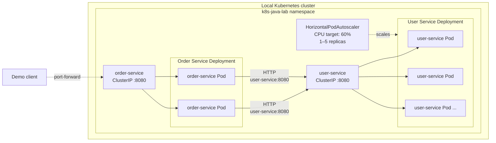

# Architecture

The lab runs two Spring Boot microservices in a local Kubernetes cluster.
`order-service` calls `user-service` through the internal Kubernetes DNS name
`user-service:8080`.

## Components

| Component | Kubernetes resource | Role |
| --- | --- | --- |
| User Service | Deployment | Runs the Spring Boot user API with CPU and memory requests/limits. |
| User Service | ClusterIP Service | Provides the stable `user-service:8080` endpoint and routes traffic to ready Pods. |
| User Service | HPA | Scales the Deployment from 1 to 5 replicas around a 60% average CPU target. |
| Order Service | Deployment | Runs the order API and calls User Service through internal DNS. |
| Order Service | ClusterIP Service | Provides the stable `order-service:8080` application entry point inside the cluster. |

Both workloads run in the `k8s-java-lab` namespace. Their resources use the
`app.kubernetes.io/name`, `app.kubernetes.io/component` and
`app.kubernetes.io/part-of` labels. Services select Pods by application name.

For the current local experiment, `kubectl port-forward` connects the client to
the Order Service. Ingress is deliberately deferred to a later sprint.

## Health and recovery

User Service exposes three health mechanisms:

- The startup probe waits for `/actuator/health` before normal probes take over.
- The readiness probe checks `/ready`; an unready Pod is excluded from Service routing.
- The liveness probe checks `/actuator/health`; repeated failures cause a container restart.

The Deployment recreates deleted Pods to reconcile the actual state with the
desired state. During sustained CPU load, the HPA adds replicas; after the load
stops and the stabilization window passes, it scales the workload back down.

## Source files

- [`namespace.yaml`](../../k8s/sprint-1/namespace.yaml)
- [`user-service-deployment.yaml`](../../k8s/sprint-1/user-service-deployment.yaml)
- [`user-service-service.yaml`](../../k8s/sprint-1/user-service-service.yaml)
- [`user-service-hpa.yaml`](../../k8s/sprint-1/user-service-hpa.yaml)
- [`order-service-deployment.yaml`](../../k8s/sprint-1/order-service-deployment.yaml)
- [`order-service-service.yaml`](../../k8s/sprint-1/order-service-service.yaml)
